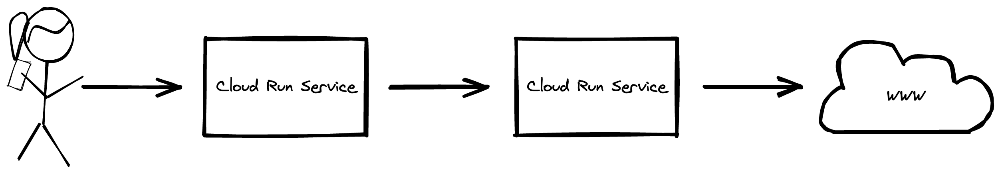
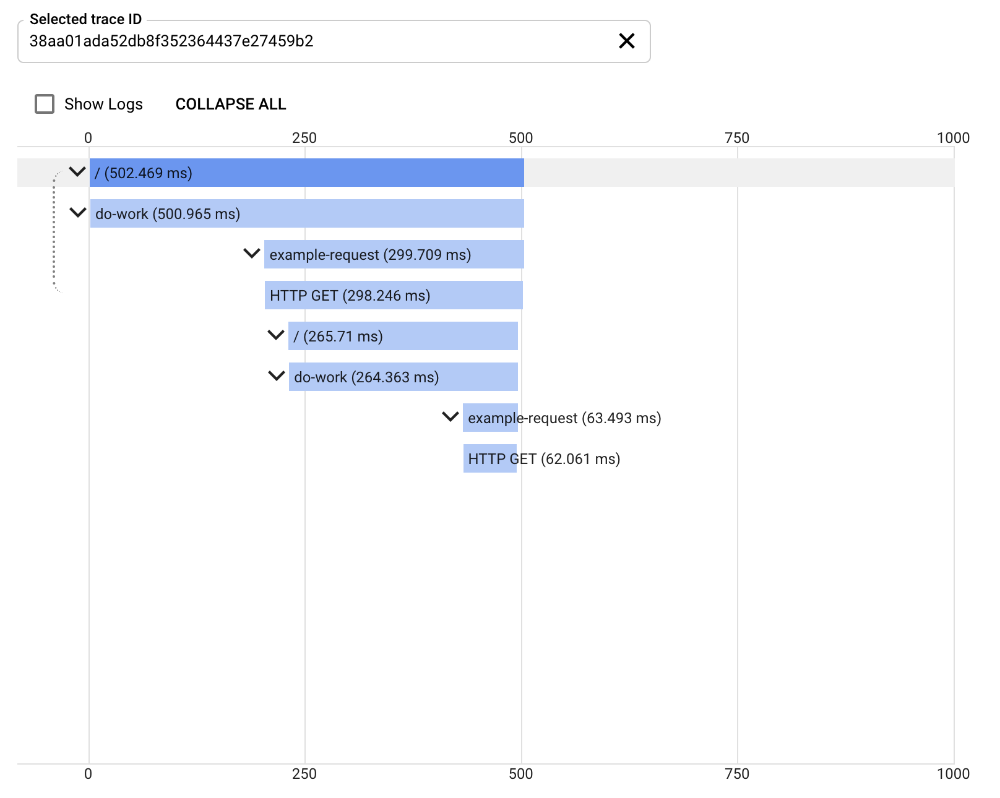
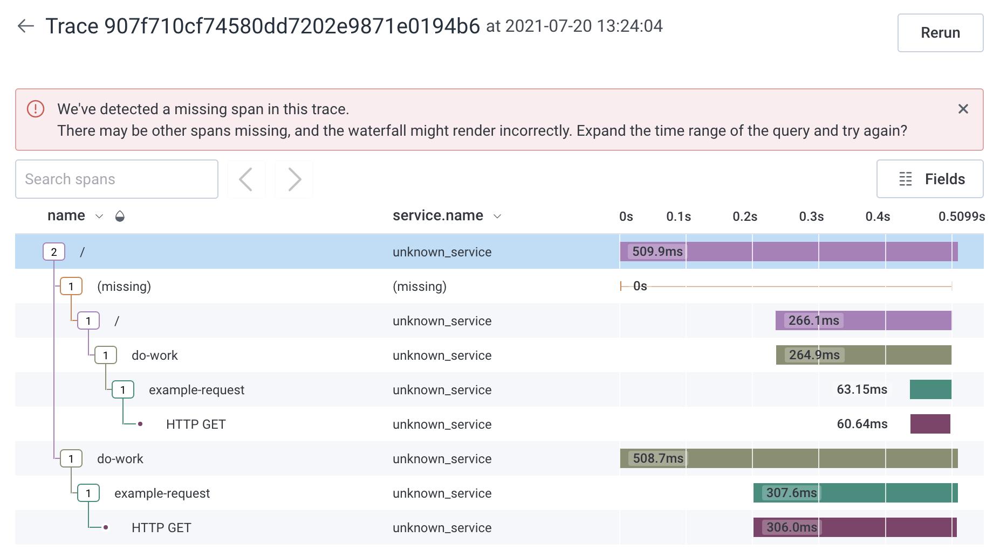
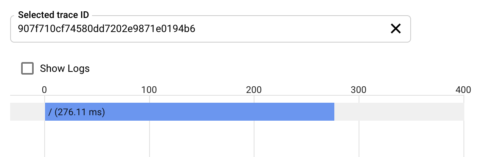

# opentelemetry-with-cloud-run

Simple Flask app to demonstrate an issue with using OpenTelemetry in Google Cloud Run with anything other that Cloud Trace.

## Rational

One thing about OpenTelemetry that is appealing is that you can instrument your application code to produce trace data, and change the OpenTelemetry exporter to send the data to any vendor that supports OpenTelemetry. However when testing vendors that support OpenTelemetry with the application running in Google Cloud Run there appears to be some of the trace data missing.

Below are steps to create a sample application that can be deployed to Cloud Run (twice) to demonstrate that OpenTelemetry instrumentation works with Cloud Trace, but not with other vendors.



## Steps To Use Cloud Trace

Create a new Google Cloud project:

```
gcloud projects create \
  --name opentelemetry-on-cloud-run \
  --set-as-default
```

Type `y` at the prompt and press `enter`:

```
No project id provided.

Use [opentelemetry-on-cloud-run-XXXXXX] as project id (Y/n)?  y
```

Before you can continue you must [enable billing](https://cloud.google.com/billing/docs/how-to/modify-project) on the project to enable the use of Cloud Run.

Enable the Cloud Run and Cloud Build APIs:

```
gcloud services enable --async \
  run.googleapis.com \
  cloudbuild.googleapis.com
```

To streamline the rest of the steps define the key configuration settings and assign them to environment variables:

```
PROJECT_ID=$(gcloud config get-value project)
```
> `PROJECT_ID` holds the project id generated at the start of the steps.


Build the sample app container 

```
gcloud builds submit . --tag=gcr.io/${PROJECT_ID}/opentelemetry-on-cloud-run
```

Deploy the container to Cloud Run

```
gcloud beta run deploy opentelemetry-01 \
  --allow-unauthenticated \
  --image gcr.io/${PROJECT_ID}/opentelemetry-on-cloud-run:latest \
  --platform managed \
  --set-env-vars="TRACING_EXPORT=google" \
  --timeout 300 \
  --region us-central1
```

Get the URL of the Cloud Run service just created.

```
URL=$(gcloud run services describe opentelemetry-01 --region us-central1 --format='value(status.url)')
```

Deploy the container to Cloud Run again, but with different environment variables

```
gcloud beta run deploy opentelemetry-02 \
  --allow-unauthenticated \
  --image gcr.io/${PROJECT_ID}/opentelemetry-on-cloud-run:latest \
  --platform managed \
  --set-env-vars="TRACING_EXPORT=google,URL_TO_CALL=${URL}" \
  --timeout 300 \
  --region us-central1
```
> Using the `URL_TO_CALL` environment variable to change the app behaviour to call the first Cloud Run service we created.


Now `curl` the second Cloud Run service URL to create an example trace in Google Cloud Trace

```
curl $(gcloud run services describe opentelemetry-02 --region us-central1 --format='value(status.url)')
```

From the trace you can see the request to `opentelemetry-02`, it's request to `opentelemetry-01`, and `opentelemetry-01` request to the external website, https://icanhazip.com/ in this example.




## Steps To Use Honeycomb

One of the vendors I wanted to try was [Honeycomb](https://honeycomb.io/).
I've signed up for one of their [free accounts](https://ui.honeycomb.io/signup) and have an API key. I've also created a dataset.

Redeploy the `opentelemetry-01` and `opentelemetry-02` Cloud Run services to switch the OpenTelemetry exporter to send the spans to Honeycomb

```
gcloud beta run deploy opentelemetry-01 \
  --allow-unauthenticated \
  --image gcr.io/${PROJECT_ID}/opentelemetry-on-cloud-run:latest \
  --platform managed \
  --set-env-vars="TRACING_EXPORT=honeycomb,HONEYCOMB_API_KEY=<YOUR-HONEYCOMB-API-KEY>,HONEYCOMB_DATASET=<YOUR-HONEYCOMB-DATASET>" \
  --timeout 300 \
  --region us-central1
```

```
gcloud beta run deploy opentelemetry-02 \
  --allow-unauthenticated \
  --image gcr.io/${PROJECT_ID}/opentelemetry-on-cloud-run:latest \
  --platform managed \
  --set-env-vars="TRACING_EXPORT=honeycomb,URL_TO_CALL=${URL},HONEYCOMB_API_KEY=<YOUR-HONEYCOMB-API-KEY>,HONEYCOMB_DATASET=<YOUR-HONEYCOMB-DATASET>" \
  --timeout 300 \
  --region us-central1
```

Now `curl` the second Cloud Run service URL again to create an example trace in Honeycomb

```
curl $(gcloud run services describe opentelemetry-02 --region us-central1 --format='value(status.url)')
```

From the trace in Honeycomb you can see the spans that have been created within the application, but they cannot be linked because the root span is missing. 




Looking back at Cloud Trace, there are still spans being created for the same trace ID. Cloud Run's native integration with Cloud Trace is still sending some trace spans to Cloud Trace.

I believe that it's this native integration with Cloud Trace that prevents the traces displaying correctly with other vendors because some of the trace data has only been sent to Cloud Trace.

